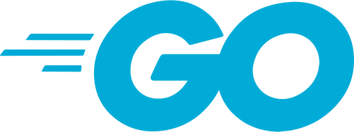

<h1 align="center">
  <br>
  
  <br>
  GO DIEGO - BOT
  <br>
</h1>

<h4 align="center">Bot features made with golang for <a href="https://www.discord.com" target="_blank">Discord</a> (is unfinished and close project yet).</h4>

<p align="center">
  <a href="#key-features">Key Features</a> •
  <a href="#how-to-use">How To Use</a> •
  <a href="#download">Download</a> •
  <a href="#credits">Credits</a> •
  <a href="#related">Related</a> •
  <a href="#license">License</a> •
  <a href="#others">Others</a>
</p>

## Key Features

* Slash commands
- The bot supports both slash commands and prefix commands  ("!"). To show slash commands, type /help.

* Command prefix
  - The bot responses with a command prefix, that's a "!".
* Ping-pong
  - If you send !ping, the bot responses pong, else if !pong, the bot responses ping.
* Help java!
  - if you type a phrase that have java in the string, the bot will tag the some members (i add example member ID) in the server to help you. (CUSTOMIZABLE)
* Greeting
  - The bot will greeting you if you send "!Oi diego" to him.
* Image generator
  - Diego bot responses with an image if you send "!picture (your substantive).
* Clear messages
  - Diego will clear the chat with the number of messages that you provide (MAX: 100). 

## How To Use

To clone and run this application, you'll need [Git](https://git-scm.com) and [Golang](https://go.dev/learn/) and the [Docker](https://www.docker.com/) to run the app in container 
```bash
# Clone this repository
$ git clone https://github.com/Leoff00/go-diego-bot.git

# Go into the repository
$ cd go-diego-bot

# Run the project locally
$ go mod download && go mod tidy && go run main.go

# Run the project in container
$ docker-compose up 
```

> **Note**
> If you're using Linux Bash for Windows, [see this guide](https://www.howtogeek.com/261575/how-to-run-graphical-linux-desktop-applications-from-windows-10s-bash-shell/) or use `golang` from the command prompt.


## Download

You can [download](https://github.com/amitmerchant1990/electron-markdownify/releases/tag/v1.2.0) the latest installable version of Markdownify for Windows, macOS and Linux.

## Credits

This software uses the following open source packages:

- [Discordgo](https://github.com/bwmarrin/discordgo)
- [Golang-stdlibs](https://pkg.go.dev/std)
- [Gorilla websocket](https://github.com/gorilla/websocket)
- [Viper](github.com/spf13/viper)

## You may also like...

- [Gocheckitout](https://github.com/Leoff00/gocheckitout) - My side project that makes request in websites simultaneously and check status and stuffs made with golang.

## License

MIT

---

## Others

<h3>Read the <a href="https://github.com/Leoff00/go-diego-bot/blob/main/CHANGELOG.MD">CHANGELOG.MD</a></h3>

